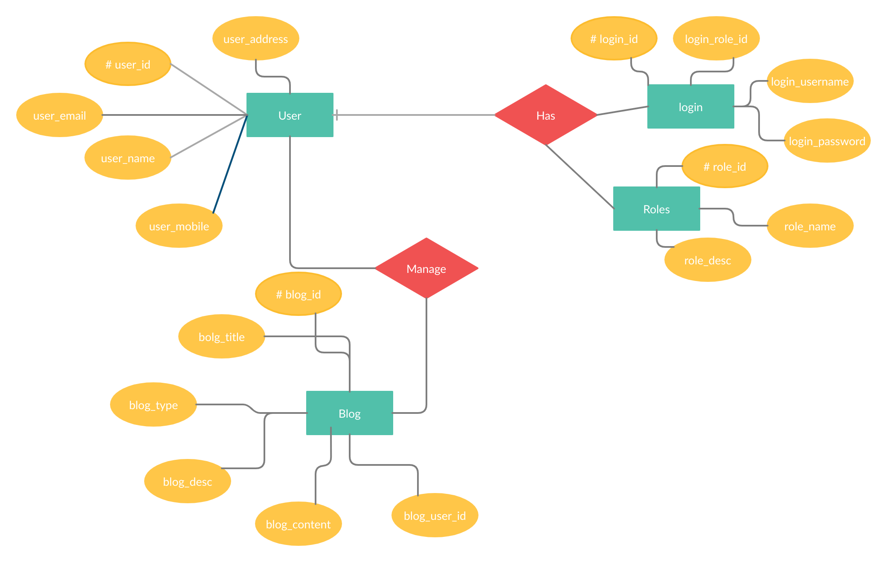

# BLOGGER

## Technologies used:

>* Flask framework
>* Python
>* Html, css for templates in frontend
>* Database used: Postgresql

---

## Er diagram for the project:

---

## Personas

>* <strong>User as a blogger: </strong>An individual writing the blogs and managing it.

>* <strong>User as a reader: </strong>An individual who reads other people's blogs but can't edit, update or delete them.

---

## User Stories

> ### User with role of blogger:
> * need to lgin with the credentials
> * create a blog post.
> * delete his blog post.
> * update his blog post.

> ### User with roleof reader:
> * see and read all posts.
> * signup and change role to blogger.
> * login and start accessing the site as a blogger.

---
