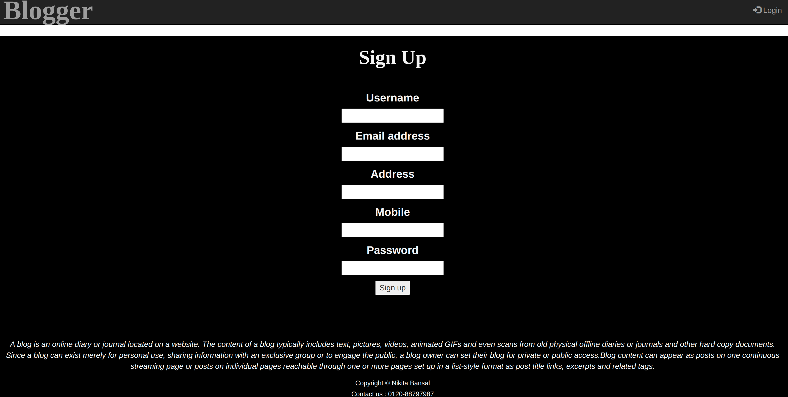
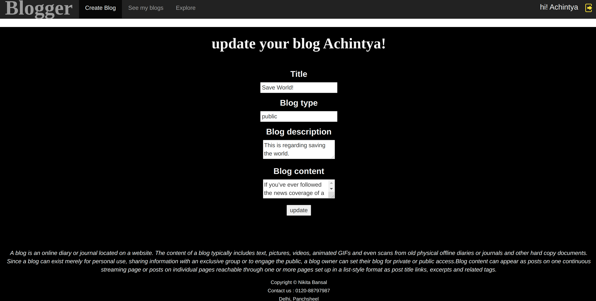

# Blogger

## Snapshots of the blogger website:

> ###  If the user is not logged in, he   can only be a reader

* ### Front Page
  
  

* ### Explore all blogs to read
  
  

* ### Show chosen blog to read
  
  

* ### If you try to access anything beyond the reader’s role
  
  

> ### If the user is logged in, he can be a reader as well as blogger

* ### When you signup
  
  

* ### When you login
  
  

* ### When you click to create a blog
  
  

* ### When you click to see your blogs
  
  

* ### When you click to see a particular blog
  
  

* ### When you click to edit the blog
  
  
  
---
  